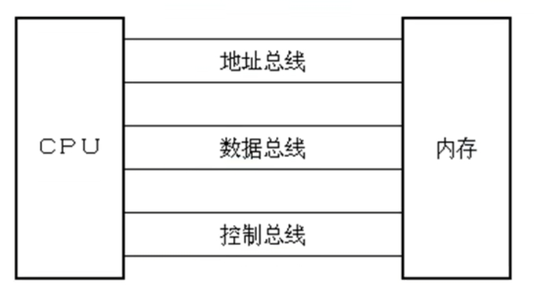
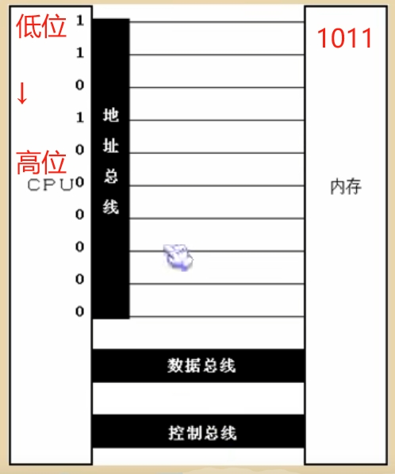
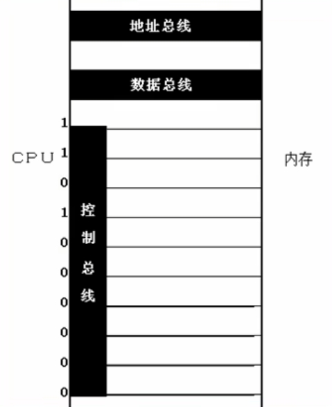
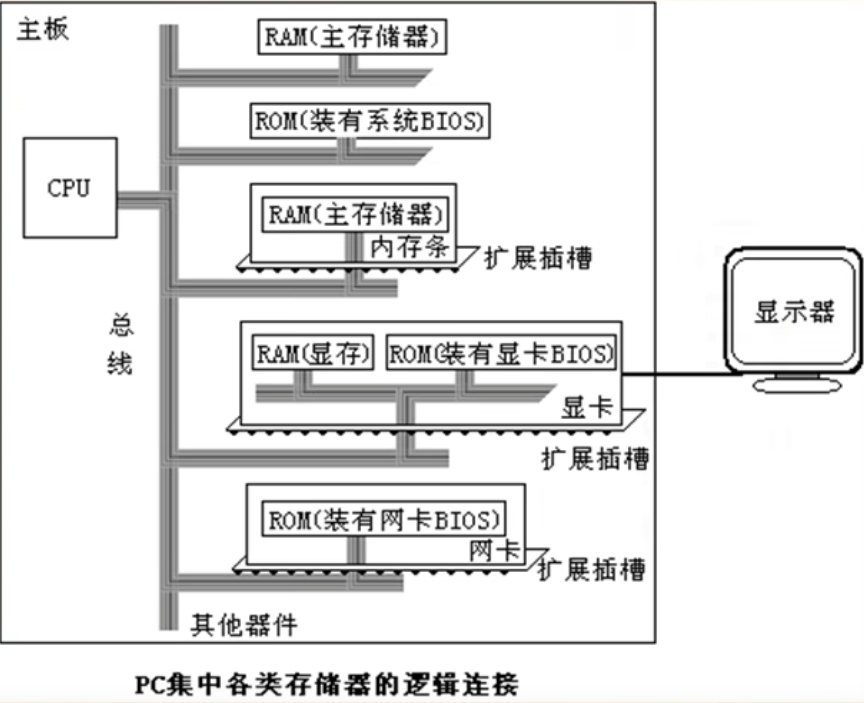
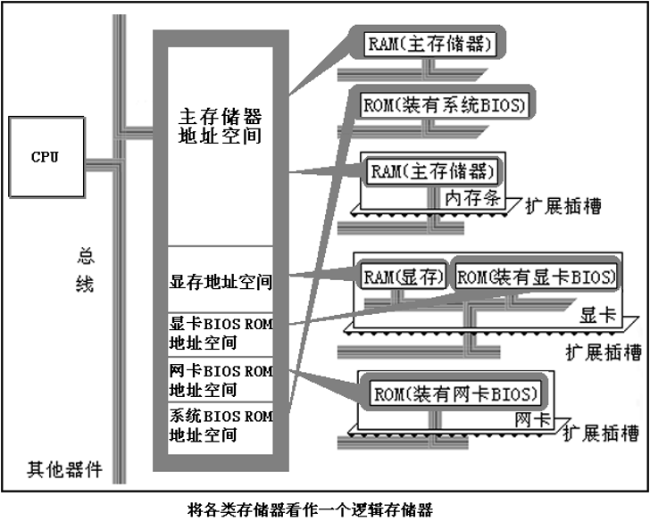
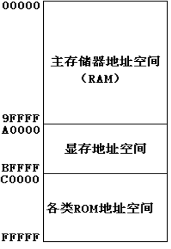

# 📘 8086 汇编入门 - 基础知识

---

## 1.1 机器语言（Machine Language）

**机器语言** = 机器指令的集合，是 CPU **唯一能直接执行**的语言，本质是二进制 0/1 的组合。

* 示例：

  * 指令：`01010000`
  * 含义：`PUSH AX`

📌 本质说明：

* 机器码本质是**电平高低的组合**
* 人类难以直接记忆、编写、调试

📎 二进制示例：

```
01010000
```

---

## 1.2 汇编语言的产生（Assembly Language）

为了解决机器语言**难读、难写、难维护**的问题，引入了汇编语言。

**汇编语言 = 机器指令的助记符表示**

| 操作含义    | 汇编指令         | 机器码示例               |
| ------- | ------------ | ------------------- |
| BX → AX | `MOV AX, BX` | `10001001 11011000` |

🔍 说明：
不同 CPU、不同指令集，**同一汇编指令可能对应不同机器码**。

🧭 汇编程序执行流程：

```
程序
 ↓
汇编指令
 ↓
汇编器（Assembler）
 ↓
机器码
 ↓
CPU 执行
```

⚠️ **CPU 永远只执行机器码，不认识汇编**

---

## 1.3 汇编语言的组成

汇编程序由三类元素构成：

| 类型   | 作用说明            |
| ---- | --------------- |
| 汇编指令 | 翻译成机器码，由 CPU 执行 |
| 伪指令  | 由汇编器处理，不生成机器码   |
| 符号   | 标号、变量名、常量       |

📌 核心结论：

> **只有“汇编指令”真正决定 CPU 做什么**

🔍 常见伪指令示例：

```
.data
.code
.stack
```

---

## 1.4 存储器（Memory）

CPU **不能脱离存储器工作**。

> CPU 再快，没有指令和数据，也什么都干不了。

### 存储器角色划分

* **内存（RAM）**

  * CPU 可直接访问
  * 存放正在运行的程序和数据

* **磁盘（Disk）**

  * 长期存储
  * 程序必须先加载到内存，CPU 才能执行

---

## 1.5 指令与数据的统一性

在存储器中：

> **指令和数据在形式上完全没有区别，都是 0 和 1**

示例：

```
1000 1001 1101 1000
```

* 作为数据：`89D8H`
* 作为指令：`MOV AX, BX`

⚠️ **是否是“指令”还是“数据”，取决于 CPU 如何解释它**

---

## 1.6 存储单元（Storage Cell）

* 存储器按 **字节（Byte）** 划分
* 1 Byte = 8 bit
* 每个字节有唯一编号（地址）

📌 示例：

* 128B 内存
* 单元编号：`0 ~ 127`

🔍 单位换算：

```
2^10 = 1024B = 1KB
```

---

## 1.7 CPU 对存储器的读写

CPU 访问存储器时，必须通过三类信息：

| 信息类型 | 作用       |
| ---- | -------- |
| 地址信息 | 访问哪个存储单元 |
| 控制信息 | 读 / 写    |
| 数据信息 | 实际数据     |

📡 这些信息通过 **总线（Bus）** 传递：

* 地址总线
* 数据总线
* 控制总线

📷 总线逻辑划分图：



示例（概念性）：

```
→ 从 3 号单元读数据到 AX
```

⚠️ 示例机器码用于理解流程，不要求记忆编码

---

## 1.8 地址总线（Address Bus）



> CPU 有 N 根地址线 ⇒ 可寻址 `2^N` 个存储单元

| CPU      | 地址线 | 可寻址空间  |
| -------- | --- | ------ |
| 8086     | 20  | 1MB    |
| 64 位 CPU | 64  | 理论 2⁶⁴ |

🚨 **重点提醒**：

64 位寻址需要 **CPU + 操作系统 + 软件** 全部支持
否则寻址能力仍然受限

---

## 1.9 数据总线（Data Bus）

数据总线宽度 = **CPU 一次能传输的数据位数**

| CPU  | 数据总线 | 说明         |
| ---- | ---- | ---------- |
| 8088 | 8 位  | 需分两次传 16 位 |
| 8086 | 16 位 | 一次完成       |

📌 结论：

> 8086 的数据吞吐能力 ≈ 8088 的 **2 倍**

---

## 1.10 控制总线（Control Bus）

控制总线用于发出控制信号，协调 CPU 与外设工作。



示例信号：

| 控制线 | 含义            |
| --- | ------------- |
| 读信号 | CPU 触发存储器输出数据 |
| 写信号 | CPU 触发存储器写入数据 |

---

## 1.11 内存地址空间（Address Space）

若 CPU 地址线宽度 = 10：

```
2^10 = 1024 个存储单元
```

👉 这 1024 个可访问单元，构成该 CPU 的**内存地址空间**

---

## 1.12 主板（Mainboard）

主板用于：

* 连接 CPU、内存、接口卡
* 提供总线与控制逻辑
* 协调各硬件部件协同工作

---

## 1.13 接口卡（Interface Card）

CPU **不能直接控制外设**（显示器、网卡、声卡等）。

📌 解决方案：

> 通过插在主板扩展槽中的 **接口卡** 间接控制外设

---

## 1.14 各类存储器芯片

### 按读写属性分类

1. **RAM**（可读写）
2. **ROM**（只读）

### 按功能分类

* 主内存 RAM
* BIOS ROM
* 接口卡上的 RAM（如显存）

### BIOS 说明

BIOS = **Basic Input / Output System**

* 由主板或接口卡厂商提供
* 提供最基础的硬件控制能力

📷 逻辑连接图：



---

## 1.15 内存地址空间（核心思想）

虽然各类存储器在**物理上独立**，但：

1. 都连接在 CPU 总线上
2. 都通过“内存读 / 写”信号访问

📌 **从 CPU 角度看：**

> 所有物理存储器
> 👉 被统一看作一个“逻辑存储器”

* 每种存储器占据一段地址空间
* CPU 访问地址 ⇒ 实际访问对应硬件

📷 示例图：




示例地址划分：

| 地址范围        | 作用      |
| ----------- | ------- |
| 0000H–7FFFH | 主内存 RAM |
| 8000H–9FFFH | 显存      |
| A000H–FFFFH | ROM     |

---

## 🎯 核心学习视角（非常重要）

> **最终执行程序的是 CPU**

因此：

* 学汇编，必须站在 **CPU 的视角**
* CPU 只看到：

  * 地址
  * 数据
  * 控制信号

📌 **内存地址空间 = CPU 眼中的全部世界**

---