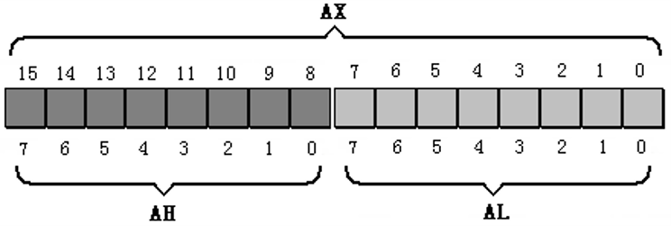
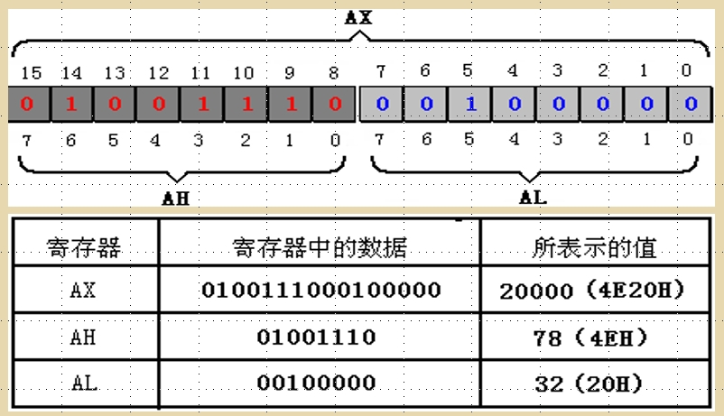
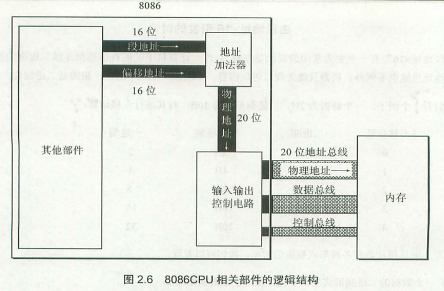

# 📘 8086 汇编入门 —— 寄存器与 CPU 工作原理

---

## 一、CPU 概述

一个典型的 CPU 由以下部分组成：

* **运算器**
* **控制器**
* **寄存器**
* 其它辅助部件

这些部件通过 **内部总线** 相互连接。

### 内部总线 vs 外部总线

* **内部总线**：
  负责 CPU 内部各器件之间的数据传送
* **外部总线**：
  负责 CPU 与主板上其它器件（内存、I/O 设备）的通信

📌 **注意**：

> 内部总线 ≠ 地址总线 / 数据总线 / 控制总线
> 这里是从“是否在 CPU 内部”的角度区分。

---

## 二、寄存器概述

### 2.0 8086 的寄存器集合

8086 CPU 一共有 **14 个寄存器**：

```
AX、BX、CX、DX、
SI、DI、SP、BP、
IP、
CS、SS、DS、ES、
PSW
```

📌 **说明**：

* 所有寄存器 **宽度都是 16 位**
* PSW 在 8086 中通常称为 **FLAGS（标志寄存器）**

---

## 三、通用寄存器（General Purpose Registers）

### 2.1 AX / BX / CX / DX

AX、BX、CX、DX 常用于存放一般性数据，称为**通用寄存器**。

8086 CPU 的寄存器全部是 **16 位寄存器**，可以存放 **2 个字节（1 word）**。

---

### 2.1.1 16 位寄存器的逻辑结构


> **这是“逻辑结构”，不是物理上真的分成两个寄存器**

---

### 2.1.2 8 位兼容设计（非常重要 ⭐）

8086 是 16 位 CPU，但为了兼容上一代 **8 位 CPU（8080 / 8085）**：

* AX 可拆分为 AH 和 AL
* BX → BH、BL
* CX → CH、CL
* DX → DH、DL



* **AL**：低 8 位（bit 0 ~ bit 7）
* **AH**：高 8 位（bit 8 ~ bit 15）

AH、AL 可以 **独立作为 8 位寄存器使用**。

📌 **关键理解 ⭐**

> AH / AL 不是“复制品”，而是 **同一个 16 位寄存器的不同部分**

---

### 2.1.3 8 位寄存器的取值范围

* 一个 8 位寄存器：

  ```
  最大值 = 2⁸ − 1 = 255
  ```



---

## 四、字在寄存器中的存储

### 2.2 字（word）的存储方式

* 一个 **字（word） = 16 位 = 2 字节**
* 可以完整存放在一个 16 位寄存器中
* 高字节 → 高 8 位寄存器
* 低字节 → 低 8 位寄存器

📌 例：

> AX 中的一个字
>
> * 高字节 → AH
> * 低字节 → AL

---

## 五、几条汇编指令（基础说明）

### 2.3 汇编指令的基本规则

* 汇编指令 **不区分大小写**

  ```
  MOV AX, BX
  mov ax, bx
  ```

### 进位与“丢失”说明 ⭐

> 当结果超过 8 位寄存器能表示的范围时，多出的进位 **不能存入该寄存器**

⚠️ **但重点是：**

* CPU **并没有真正丢弃进位**
* 进位信息会体现在 **标志寄存器（FLAGS）** 中
* 这个问题将在后续课程详细讨论

---

## 六、物理地址的概念

### 2.4 物理地址（Physical Address）

CPU 访问内存时，必须给出一个 **唯一的地址**。

* 所有内存单元组成一个 **一维线性空间**
* 每个内存单元都有一个唯一编号
* 这个编号称为 **物理地址**

---

## 七、什么是“16 位结构的 CPU”

### 2.5 16 位结构的含义

“16 位结构”表示：

1. 运算器一次最多处理 **16 位数据**
2. 寄存器最大宽度为 **16 位**
3. 寄存器 ↔ 运算器 的数据通路为 **16 位**

📌 **注意**：

> “16 位 CPU” ≠ “只能访问 64KB 内存”

---

## 八、8086 的寻址能力与地址形成

### 2.6 8086 CPU 如何给出物理地址 ⭐⭐⭐

* 8086 有 **20 位地址总线**
* 最大寻址空间：

  ```
  2²⁰ = 1MB
  ```

但：

* 8086 内部是 **16 位结构**
* 单个寄存器只能存 **16 位地址（64KB）**



---

### 2.6.1 物理地址的形成过程

8086 访问内存时：

1. 提供两个 16 位地址：

   * **段地址**
   * **偏移地址**
2. 两者送入 **地址加法器**
3. 合成 20 位物理地址

**公式：**

```
物理地址 = 段地址 × 16 + 偏移地址
```

📌 常见说法：

* 段地址 × 16
* 等价于 **段地址左移 4 位**

---

## 九、“段地址 × 16 + 偏移地址”的本质 ⭐⭐⭐

### 2.7 本质理解

本质不是“内存真的被分段”，而是：

> **基础地址 + 偏移量 = 实际地址**

8086 只是 **用两个 16 位数凑出 20 位地址**。

你提到的两个比喻是为了说明：

* CPU 本身的限制
* 设计上的权衡方案

📌 **经典总结 ⭐**

> 段是 CPU 的逻辑概念，不是内存的物理划分

---

## 十、段的概念（纠正常见误区）

### 2.8 段不是内存的物理结构 ⭐

❌ 错误认识：

> 内存被划分成一个一个的段

✅ 正确认识：

> 内存是连续的
> **段是 CPU 使用地址方式形成的逻辑概念**

#### 段的两个性质：

1. 段起始地址一定是 **16 的倍数**
2. 段最大长度：

   ```
   2¹⁶ = 64KB
   ```

---

### 同一物理地址的多种表示 ⭐

例：

```
物理地址：21F60H
```

可能的逻辑表示：

* 2000:1F60
* 1FFF:2060
* 21F6:0000

📌 **结论**：

> 段地址 + 偏移地址 **不是唯一的**

---

## 十一、段寄存器

### 2.9 段寄存器的作用

8086 有 **4 个段寄存器**：

```
CS（代码段）
DS（数据段）
SS（堆栈段）
ES（附加段）
```

它们 **只提供段地址**，不存数据本身。

---

## 十二、CS 和 IP（最重要 ⭐⭐⭐）

### 2.10 CS : IP 的含义

* **CS**：代码段寄存器
* **IP**：指令指针寄存器

它们共同指向 **下一条将被执行的指令**。

---

### 2.10.1 上电复位状态

8086 刚启动时：

```
CS = FFFFH
IP = 0000H
```

形成的物理地址：

```
FFFF0H
```

📌 这是 **CPU 执行的第一条指令地址**

---

### 2.10.2 CPU 的取指—执行过程 ⭐

1. 从 CS:IP 指向的内存单元取指令
2. IP 自动指向下一条指令
3. 执行指令
4. 重复上述过程

---

### 2.10.3 为什么不能用 mov 改 CS / IP？⭐

* `mov` 是**传送指令**
* **不允许直接修改 CS / IP**
* 否则会破坏 CPU 的取指机制

---

### 2.10.4 如何修改 CS / IP？

#### 同时修改 CS 和 IP：

```
jmp 段地址:偏移地址
```

例：

```
jmp 2AE3:0003
```

#### 只修改 IP：

```
jmp ax
jmp bx
```

📌 等价理解：

```
jmp ax  ≈  IP ← AX
```

---

## 十三、代码段的概念

### 2.12 代码段的本质 ⭐

* 程序员可以 **人为规划** 一段内存作为代码段
* **CPU 并不关心你的规划**
* CPU 只执行 **CS:IP 指向的内容**

📌 **关键结论 ⭐**

> 是否被当作指令执行，完全由 CS:IP 决定

---

## 十四、DEBUG 实验工具（入门必会）

实验一：DEBUG

常用命令：

| 命令 | 作用         |
| -- | ---------- |
| R  | 查看 / 修改寄存器 |
| D  | 查看内存       |
| E  | 修改内存       |
| U  | 反汇编        |
| T  | 单步执行       |
| A  | 写入汇编指令     |

---